# CareGrid — Low-Level Design

A component- and interaction-level walkthrough of the `src/caregrid` codebase.
Read `CONTEXT.md` for the ubiquitous language and `docs/adr/` for the
architectural decisions this design implements.

Sources: `src/caregrid/engine.py`, `scenario.py`, `clock.py`, `survival.py`,
`sofa.py`, `profile.py`, `survival_model.py`, `cli.py`, `web.py`.

---

## 1. Architecture overview

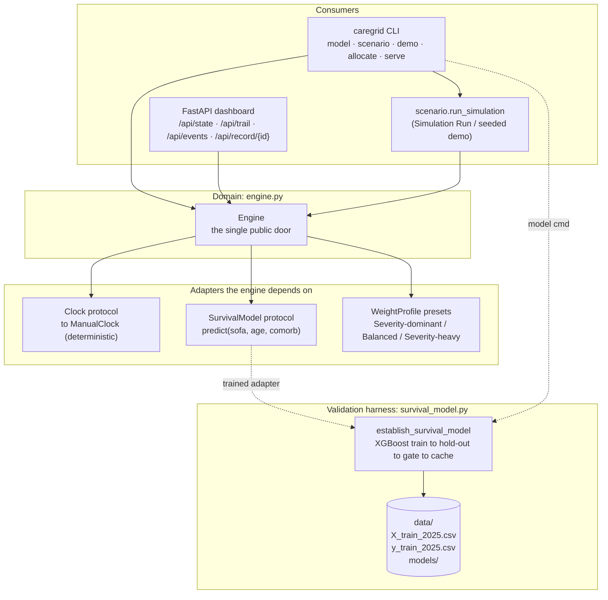

Key property: the **engine never trains or runs a model** — it only talks to the
`SurvivalModel` protocol. The trained model (or the constant test stand-in) is
injected from outside; the validation harness is an offline gate, not runtime.

---

## 2. Module map

| Module | Responsibility | Public surface |
|---|---|---|
| `clock.py` | Time source abstraction | `Clock` (protocol), `ManualClock` |
| `sofa.py` | SOFA score value object | `Sofa` (`severity()`, `from_total()`) |
| `survival.py` | Model output + adapter seam | `SurvivalPrediction`, `SurvivalModel` (protocol) |
| `profile.py` | Weight presets | `WeightProfile`, `SEVERITY_DOMINANT`, `BALANCED`, `SEVERITY_HEAVY` |
| `engine.py` | All domain behaviour | `Engine`, all record types, exceptions |
| `scenario.py` | Scripted demo / seeded live view | `run_simulation`, `demo_engine` |
| `survival_model.py` | Train + validate + servable adapter | `establish_survival_model`, `TrainedSurvivalModel` |
| `cli.py` | CLI consumers | `main` |
| `web.py` | Read-only JSON API (FastAPI) | `create_dashboard_app` |

---

## 3. Domain object model

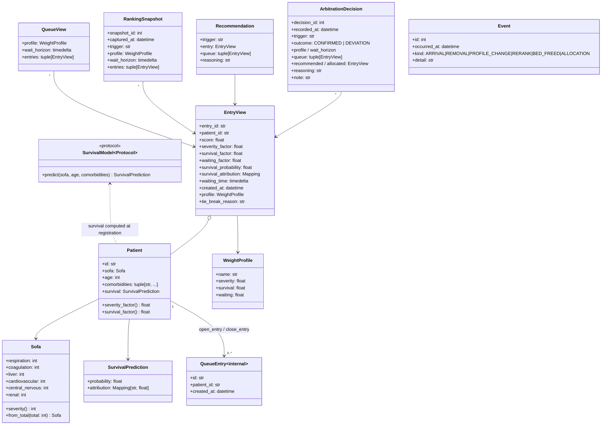

Two distinct "patients": **`Patient`** is the identity + clinical attributes
(persists across visits) and **`QueueEntry`** is one waitlist occupancy carrying
`created_at` (resets per visit). `EntryView` is the **computed** projection of a
queue entry at an instant — score, factors, SHAP attribution — which is what all
ranking, snapshots, and decisions are built from.

### Engine internal state

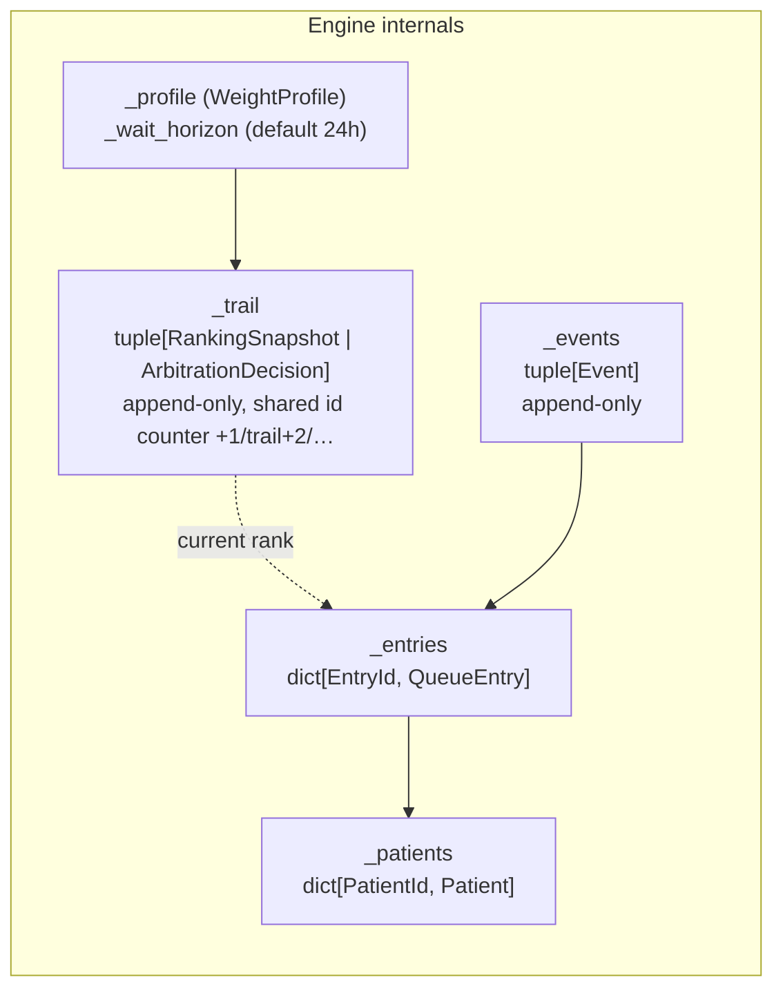

Snapshots and decisions share the single `_next_trail` counter, so the trail is
one chronological interleaved sequence (e.g. `1 ward-opened, 2 removal,
3 tip-arrival, 4 bed-freed, 5 decision, 6 post-allocation`).

---

## 4. Scoring, ranking, and the Tie-Break Cascade

### Priority score computation (`engine._entry_view`)

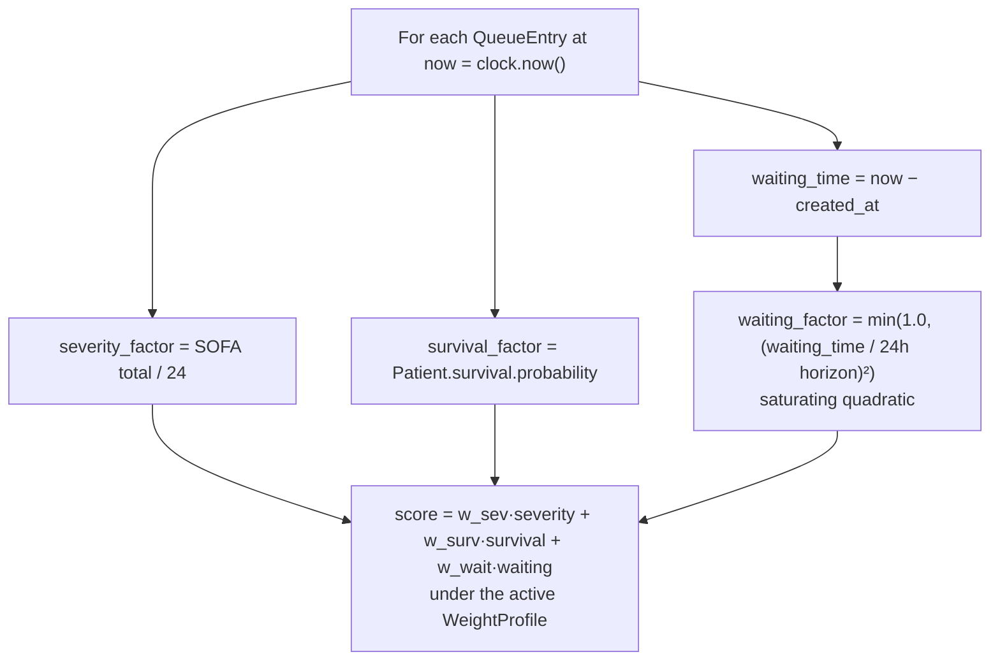

### Deterministic sort key (`engine._rank`)

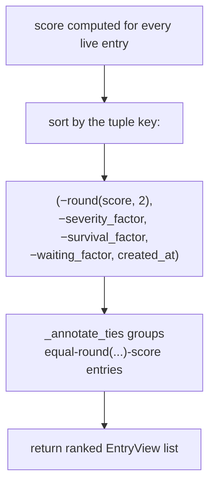

The 2-decimal **rounding** is what counts as a "near-tie"; the next four sort
keys *are* the cascade, applied implicitly. `_annotate_ties` then walks each
equal-rounded group and stamps the winner of each adjacent pair with the stage
that decided it.

### Tie-Break Cascade reasoning (`engine._tie_break_reason`)

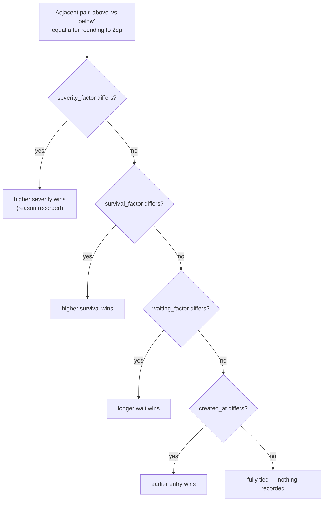

### Weight profiles (`profile.py`)

| Profile | severity | survival | waiting |
|---|---|---|---|
| Severity-dominant (default) | 0.5 | 0.3 | 0.2 |
| Balanced | 0.4 | 0.3 | 0.3 |
| Severity-heavy | 0.6 | 0.25 | 0.15 |

Every `EntryView`, snapshot, and decision carries the `profile` it was scored
under, so any score is traceable to its profile.

---

## 5. Command flow — register → rank → arbitrate

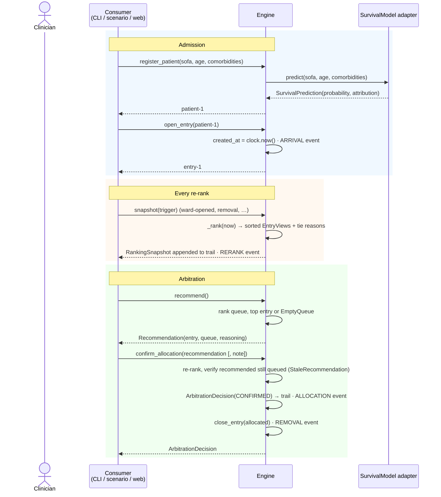

The clinician-path detail (`engine._allocate`):

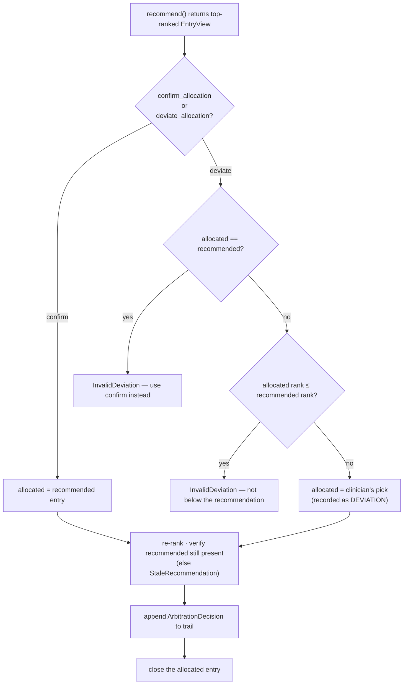

---

## 6. The Simulation Run — how initial data is seeded

The seeded "initial data" is **hand-engineered, not generated**. A five-member
cast plus a deterministic `ManualClock` plays a fixed timeline; no PRNG is
involved in the queue (the only configurable seed in the codebase is the
model's hold-out split, §7).

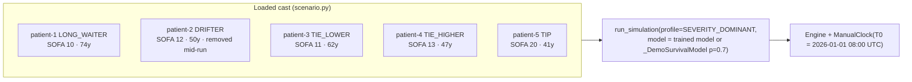

### Timeline (`T0` = 2026-01-01 08:00 UTC, `hour` = 1h increments)

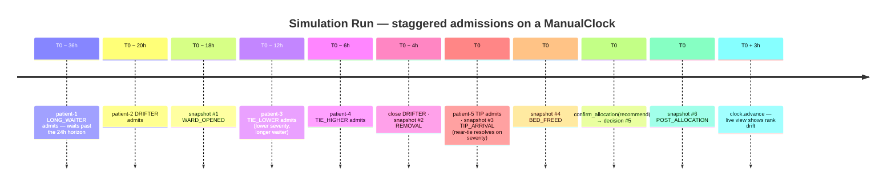

Two survival sources, deliberately:
- **`_DemoSurvivalModel`** — constant `p = 0.7` with fixed attributions; keeps
  tests and dashboard-tests deterministic and the edge cases provable by hand.
- **`TrainedSurvivalModel`** — the validated booster, injected on demonstration
  paths (CLI, dashboard) via `establish_survival_model` (the ticket-8 gate).
  Structure of the scenario is identical; numbers under the real model differ.

`demo_engine(model)` (web.py's seed) is just `run_simulation` under the default
Severity-dominant profile.

---

## 7. Survival-model training / validation / gate

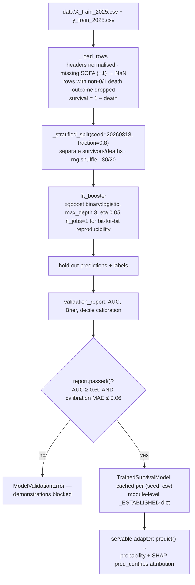

`TrainedSurvivalModel.predict` feeds `[sofa_total, age, comorbidity_count]` to
the booster and reads native `pred_contribs` as the SHAP attribution (ADR-0004).

---

## 8. Read side — web dashboard and CLI

### Web (FastAPI, read-only)

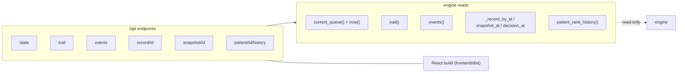

Every value is derived from engine reads — the web layer performs no decision
logic. `_movement_by_entry` compares the live queue order against the last
snapshot's (up / down / unchanged / new) purely as a projection.

### CLI subcommands

| Command | Behaviour |
|---|---|
| `model` | Train + validate + record `data/models/validation_report.json` |
| `scenario` | Replay the Simulation Run (all three profiles, or `--profile`) |
| `demo` | Print ranked queue (default ward, `PATIENT` specs, or `--csv`); `--advance-hours` re-ranks |
| `allocate` | Recommend + record the decision; `--deviate` for a conscious deviation with `--note` |
| `serve` | Launch the FastAPI dashboard over a seeded engine |

---

## 9. Test strategy hooks the design makes possible

The seams are deliberate:

- **`Clock` protocol / `ManualClock`** — time-bombs (hour boundaries, horizon
  saturation) are exact.
- **`SurvivalModel` protocol** — the stand-in makes any test deterministic
  without training; the trained adapter is validated separately.
- **Immutable record types** — snapshots/decisions/events are compared for
  equality, and the `trail()` tuple is asserted in order.
- **Frozen `Sofa` / `WeightProfile`** — no accidental mutation of shared presets.

---

## 10. Failure modes

| Condition | Exception | Raised by |
|---|---|---|
| register/open on unknown patient or entry | `UnknownPatient` / `UnknownEntry` | `open_entry`, `close_entry`, `patient_rank_history` |
| snapshot/decision lookup miss | `UnknownSnapshot` / `UnknownDecision` | `snapshot_at`, `decision_at` |
| recommend with empty queue | `EmptyQueue` | `recommend` |
| recommended entry left the queue | `StaleRecommendation` | `_allocate` |
| confirm-vs-deviate misuse or not-above-recommendation deviation | `InvalidDeviation` | `deviate_allocation`, `_allocate` |
| model failed validation gate | `ModelValidationError` | `establish_survival_model` (blocks demo/scenario/serve) |